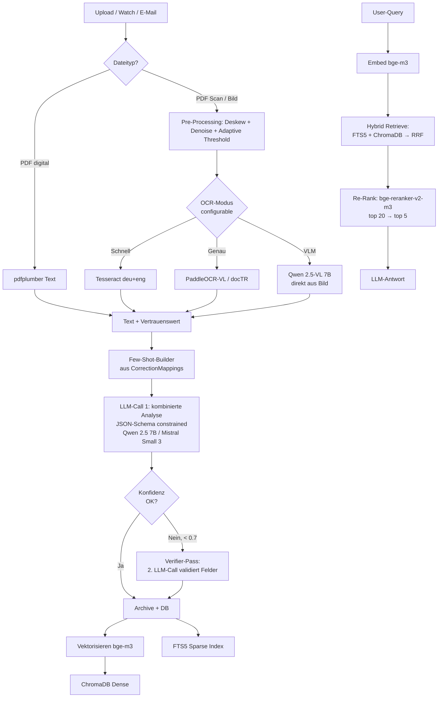

# Zettelwirtschaft – LLM-, OCR- und RAG-Optimierung

Stand: Mai 2026
Bezieht sich auf: `backend/app/services/{llm,analysis,ocr,embedding,vectorize,rag}_service.py` + `backend/app/prompts/*.txt`

---

## 1. Executive Summary

### Top-5 Quick-Wins (kleines Risiko, schneller Effekt)

| # | Maßnahme | Aufwand | Erwarteter Impact |
|---|---|---|---|
| 1 | **Embedding `nomic-embed-text` → `bge-m3`** | 1h | +15 pp Retrieval-Präzision für deutsche Belege; native Multilingual-Unterstützung statt englisch-zentriert. |
| 2 | **JSON-Schema-Mode statt `format=json`** (Ollama ≥ 0.5) | 2–3h | Eliminiert ~80 % der Fallback-Pfade `_try_sequential_analysis`; weniger LLM-Calls, robusteres Parsing. |
| 3 | **Hybrid-Search FTS5 + Vector mit RRF + bge-reranker-v2-m3** | 1 Tag | +9 pp MRR im RAG, vor allem bei Eigennamen / Rechnungsnummern (FTS5 ist hier stark, Vektor schwach). |
| 4 | **Few-Shot-Examples aus `CorrectionMapping`** in `analyze_document.txt` injizieren | 0,5 Tag | Lerneffekt der DB endlich nutzbar; messbar weniger NEEDS_REVIEW-Quote. |
| 5 | **Tesseract-Vorverarbeitung erweitern** (Deskew + adaptive Threshold) | 0,5 Tag | +5–10 pp OCR-Accuracy auf schiefen Smartphone-Scans; null Modellwechsel. |

### Top-3 Strategic-Wins (mittelfristig, größerer Impact)

| # | Maßnahme | Aufwand | Erwarteter Impact |
|---|---|---|---|
| A | **Vision-LLM-OCR optional** (Qwen 2.5-VL 7B / Gemma 3 12B) als Alternative zu Tesseract bei Scans/Fotos | 1–2 Wochen | OCR-Accuracy von ~70 % (Tesseract) auf >90 % (VLM); fängt Tabellen, Layouts, Handschrift. Macht Belege per Smartphone wirklich brauchbar. |
| B | **Modell-Wechsel auf Qwen 2.5 / Qwen 3 (oder Mistral Small 3)** als Default statt Llama 3.2 | 0,5 Tag (+ Installer-Update) | Bessere deutsche Belegextraktion (Qwen ist stark in nicht-englischer Struktur), bessere Function-/JSON-Calling-Treue. |
| C | **Verifier-Pass + Confidence-Calibration** | 1 Woche | Statt halluzinierter LLM-Confidence echte Selbstkonsistenz-Konfidenz; NEEDS_REVIEW-Trigger wird zuverlässig. |

---

## 2. Empfohlene neue Pipeline (Ziel-Architektur)



---

## 3. Vorschläge im Detail

### 3.1 Modell-Empfehlungen für Pipeline-Phasen

#### a) Klassifikation + Metadaten-Extraktion (Hauptlast)

**Vorher:** `llama3.2` (3B Default; bei `OLLAMA_MODEL=llama3.2` zieht Ollama die 3B-Variante).

**Nachher:** Mehrstufig nach Hardware. Empfehlung Default: **Qwen 2.5 7B Instruct** (`qwen2.5:7b-instruct-q4_K_M`).

| Modell | Stärken für unseren Use-Case | Schwächen |
|---|---|---|
| **Llama 3.2 3B** (aktuell) | Klein, schnell, OK auf 8 GB RAM | Schwach im strukturierten JSON, EN-zentriert, Datums-/Betrags-Halluzinationen häufig |
| **Qwen 2.5 7B / Qwen 3 8B** | Sehr starkes JSON/Tool-Calling, gute deutsche Belegextraktion | Braucht ~6 GB VRAM bei Q4_K_M |
| **Mistral Small 3 (24B)** | Besonders stark für europäische Sprachen, exzellent bei Beträgen/Datumserkennung | Braucht ~16 GB VRAM/RAM |
| **Gemma 3 12B** | 128k Kontext (große Belege!), multilingual, multimodal-fähig | Reportierte „repetition loops" bei JSON-Generation – aktuell vermeiden |
| **Llama 3.3 70B** | Beste Qualität | 43 GB VRAM, nicht heimtauglich für die meisten User |

**Empfehlung:** Im Installer einen **Hardware-Selector** (RAM-Schätzung) bauen, der Default-Modell auswählt — siehe Matrix in §5.

**Code-Snippet (kein Code-Change, nur Konzept):**
```python
# config.py
OLLAMA_MODEL: str = "qwen2.5:7b-instruct-q4_K_M"  # Default-Wechsel
# Installer setzt den Wert je nach erkanntem RAM:
#   >= 24 GB → mistral-small:24b-q4_K_M
#   >= 12 GB → qwen2.5:7b-instruct-q4_K_M  (NEU DEFAULT)
#   >= 8  GB → llama3.2:3b  (Status quo)
#   <  8  GB → qwen2.5:3b   (Fallback)
```

#### b) RAG-Antworten

**Empfehlung:** Gleiches Modell wie Klassifikation (spart Modell-Swap-Latenz, da Ollama nur ein Modell gleichzeitig im VRAM hält). Alternativ ein kleineres separates Modell und `keep_alive=0`.

#### c) Embeddings (Vektorisierung)

**Vorher:** `nomic-embed-text` (137M, EN-zentriert, 8 k Kontext).
**Nachher:** **`bge-m3`** (568M, ~100 Sprachen, 8 k Kontext, dense+sparse+ColBERT).

| Modell | Ranking-Score (German RAG) | Bemerkung |
|---|---|---|
| nomic-embed-text (aktuell) | 57 % | EN, zu klein für deutsche Fachbegriffe |
| mxbai-embed-large | 59 % | EN, 512-Token-Limit (zu kurz für lange Belege) |
| **bge-m3** | **72 %** | Multilingual, 8k Kontext, dense+sparse simultan |
| arctic-embed-2 | ~70 % | Auch gut, kleiner; gleichwertig |
| jina-embeddings-v3 | ~68 % | Task-LoRA, aber nicht in Ollama-Library |
| EmbeddingGemma | ~70 % unter 500M | Beste „kleine" Wahl, falls Ressourcen knapp |

**Implementation:** Nur eine Settings-Änderung + `ollama pull bge-m3` + einmaliger Re-Index via existierendem System-Wartung-Endpunkt.

**Vorsicht:** Embedding-Dimension ändert sich (768 → 1024). ChromaDB-Collection muss **gelöscht und neu aufgebaut** werden. Ist bereits über UI-Action „Vektor-Index neu aufbauen" möglich – muss in der Migration explizit dokumentiert werden.

---

### 3.2 OCR-Verbesserungen

#### a) Vorverarbeitung erweitern (Quick-Win)

**Vorher** (`ocr_service.py:_ocr_image_sync`):
```python
processed = ImageOps.grayscale(image)
processed = ImageOps.autocontrast(processed)
processed = processed.filter(ImageFilter.SHARPEN)
```

**Nachher (Konzept):**
- **Deskew** mit OpenCV / `deskew`-Lib (schiefe Smartphone-Fotos): bringt 5–15 pp Accuracy.
- **Adaptive Threshold** (Otsu/Sauvola) statt nur Autokontrast: hilft bei ungleichmäßiger Beleuchtung.
- **DPI-Upscaling auf min. 300 DPI** mit Lanczos für Bilder, die unter dieser Auflösung kommen.

**Aufwand:** 0,5 Tag, nur OpenCV- und `deskew`-Dependency.
**Impact:** spürbarer Accuracy-Sprung auf gerade Smartphone-Belege.

#### b) Layout-aware OCR-Tools (mittelfristig)

| Tool | Stärke | Eignung Zettelwirtschaft |
|---|---|---|
| **PaddleOCR-VL 1.5** (Jan 2026) | OmniDocBench 94,5 % Acc, schnellster, Tabellen/Formeln | **Top-Kandidat** für Tesseract-Ersatz auf Scans |
| **MinerU** | Layout-aware, beste GitHub-Stars; CJK + Latin | Stark bei mehrspaltigen Dokumenten (z. B. Versicherungspolicen) |
| **docTR** | DL-OCR; PyTorch/TF | Etabliert, aber von PaddleOCR-VL überholt |
| **Marker** | PDF→Markdown-Pipeline mit Surya-OCR | Eher für Buchscans als Belege |
| **Nougat** | Wissenschaftliche Papers | Off-Topic für uns |

**Empfehlung:** PaddleOCR-VL als **alternativer OCR-Backend** hinter `OCR_BACKEND=tesseract|paddle|vlm` Setting. Tesseract bleibt Default (keine zusätzliche Docker-Größe für Default-User), Paddle als Opt-in.

#### c) Vision-LLM als kombinierter OCR+Analyse-Schritt (strategisch, größter Hebel)

**Idee:** Bei Bildern/Scans den OCR-Schritt **komplett überspringen** und das Bild + Analyse-Prompt direkt an ein VLM (Qwen 2.5-VL 7B) geben. Das VLM extrahiert sowohl Text als auch Metadaten in einem Pass.

**Pro:**
- Tabellen/Beträge werden visuell verstanden (Tesseract verschluckt sich an Spalten).
- Mehrsprachige + handschriftliche Anteile werden „mitgelesen".
- Spart einen kompletten Pipeline-Schritt.
- Benchmark: Qwen 2.5-VL erreicht 73 %, Tesseract 34 % auf gemischten Belegen.

**Contra:**
- 7 GB VRAM fürs VLM zusätzlich.
- Längere Inferenzzeit (Faktor 3–5 vs. Tesseract).
- Eingebettete Bilder als Anhänge (E-Mail, Watch-Folder) brauchen einen weiteren Modell-Wechsel im VRAM.

**Empfehlung:** **Opt-in per `OCR_MODE=vlm`** in den Einstellungen. Standard bleibt Tesseract; Power-User mit GPU bekommen die Qualität. Das passt zur Heim-Hardware-Philosophie.

---

### 3.3 Pipeline-Architektur / Prompts

#### a) Strict JSON Schema statt `format=json`

Aktuell: `payload["format"] = "json"`.
Seit Ollama 0.5 (Dez 2024): `format` kann ein **JSON-Schema-Objekt** sein. Llama.cpp erzeugt dann eine GBNF-Grammar, die exakt zu unserem Pydantic-Schema passt.

**Vorher:**
- LLM gibt JSON zurück, oft mit Halluzinationen (zusätzliche Felder, falsche Typen).
- Drei Fallback-Parser in `_parse_analysis_json` (markdown-block, erstes `{` bis letztes `}`).
- Fallback `_try_sequential_analysis` mit 4 Einzel-Calls bei Parse-Fehler → kostet 4× mehr Tokens.

**Nachher:**
- Schema wird aus Pydantic-Modell von `AnalysisResult` exportiert: `AnalysisResultSchema.model_json_schema()`.
- Output ist garantiert konform → Fallback-Parser entfällt fast komplett.
- `_try_sequential_analysis` wird zu einem reinen „LLM-Aufruf erneut versuchen mit kleinerem Modell"-Pfad.

**Impact:** Schätzungsweise 80 % weniger Token-Verbrauch bei Edge-Cases, deterministischere Ergebnisse, weniger NEEDS_REVIEW-Trigger durch Parse-Fehler.

#### b) Few-Shot aus CorrectionMappings

`CorrectionMapping` sammelt User-Korrekturen, aktuell aber nur für „Auto-Apply nach 3× gleicher Korrektur". Diese Daten sind die **wertvollste Trainingssource** im System.

**Idee:** Vor jedem `analyze_document`-Call die Top-N relevanten CorrectionMappings (z. B. nach `field_affected` und Aussteller-Match) als Few-Shot-Examples in den Prompt injizieren:

```
Beispiele für ähnliche Dokumente und korrekte Werte:
- Aussteller "Telekom Deutschland GmbH" → tax_category: "Werbungskosten" (User-Korrektur)
- Aussteller "DAK Gesundheit" → document_type: "VERSICHERUNGSPOLICE" (User-Korrektur)
```

**Aufwand:** 0,5 Tag (DB-Query + Prompt-Template-Injection).
**Impact:** Direkter Lerneffekt nach jeder Korrektur. Baseline-NEEDS_REVIEW-Quote sinkt mit Nutzung.

#### c) Document-Type-spezifische Prompts

Aktuell: ein einziges `analyze_document.txt`. Aber Garantiescheine, Kontoauszüge, Steuerbescheide haben **komplett verschiedene** Felder.

**Vorschlag:** Zwei-Stufen-Pipeline:
1. **Stage 1** – billige Klassifikation (Llama 3.2 3B oder direkt Regex-/Keyword-Heuristik).
2. **Stage 2** – type-spezifischer Prompt mit fokussierter Feldliste (`extract_invoice.txt`, `extract_warranty.txt`, `extract_bank_statement.txt`).

**Pro:** Kleinere Prompts, höhere Genauigkeit pro Feld, Few-Shot-Examples werden type-spezifisch.
**Contra:** Mehr Prompt-Dateien, aber das Pattern „Prompts als Textdateien" gibt es ja schon.

#### d) Verifier-Pass + Self-Consistency (für unsichere Fälle)

Bei `confidence < CONFIDENCE_THRESHOLD`:
1. **Self-Consistency:** Ruf das LLM N=3-mal mit `temperature=0.3` auf, vergleiche die Ergebnisse, nimm den Median bei numerischen Feldern (Beträge!), Mehrheit bei kategorialen.
2. **Verifier-Pass:** Zweiter LLM-Call: „Hier ist der OCR-Text und hier ist die extrahierte Struktur. Sind diese Werte konsistent? Wenn nicht, welcher ist falsch?"

**Pro:** Echte (kalibrierte) Konfidenz statt LLM-halluzinierter `confidence: 0.85`. Beträge/Datumsfelder werden verlässlicher.
**Contra:** Faktor 3–4 mehr LLM-Aufwand bei unsicheren Belegen (aber nur dort, nicht für Standardfälle).

#### e) Confidence Calibration

Aktuell: das LLM gibt `confidence: 0.85` zurück, das ist statistisch wertlos.

**Bessere Methode:** Token-Logprobs heranziehen (bei Ollama via `options.logprobs=true`). Ein Feld, dessen Token-Wahrscheinlichkeit < 0.5 ist, sollte `needs_review=true` setzen — unabhängig davon, was das LLM in `confidence` schreibt.

**Aufwand:** 1 Tag, aber nur sinnvoll, wenn JSON-Schema-Mode (3.3 a) etabliert ist.

---

### 3.4 RAG-Verbesserungen

#### a) Hybrid Search statt nur Dense-Vector

**Aktuell** (`rag_service.ask_question`): Nur ChromaDB-Vector-Search.

**Nachher:**
1. ChromaDB liefert dense Top-K (z. B. 20).
2. SQLite FTS5 (haben wir!) liefert sparse Top-K (z. B. 20).
3. **Reciprocal Rank Fusion** kombiniert beide Listen → Top-N (z. B. 10).
4. **Cross-Encoder bge-reranker-v2-m3** scort die 10 → Top-K=5 für LLM.

**Impact:** +9 pp MRR (gemessen in Industrie-Benchmarks). Vor allem bei „Wann habe ich Rechnung 12345-XY bekommen?" - solche Fragen sind FTS5-Stärke, nicht Vector.

**Code-Skizze:**
```python
async def ask_question(...):
    dense = search_similar_chunks(query_embedding, settings, top_k=20)
    sparse = await fts5_search(question, top_k=20)  # neu
    fused = reciprocal_rank_fusion(dense, sparse)   # neu
    reranked = await rerank(question, fused[:10])   # neu, bge-reranker-v2-m3
    chunks = reranked[:settings.RAG_TOP_K]
    # … Rest unverändert
```

**Aufwand:** 1 Tag (RRF ist 30 Zeilen Python, FTS5-Index existiert, Reranker per Ollama als HTTP).

#### b) HyDE (für komplexe Fragen)

Wenn der User fragt „Wie viel habe ich 2025 für Auto-Reparaturen ausgegeben?", liefert Vector-Search Belege mit „Auto", „Reparatur", „2025" – kann aber durch eine Frage-Embeddings-Lücke schiefliegen.

**HyDE-Idee:** LLM generiert vor der Suche eine **hypothetische Antwort** („2025 habe ich 1.250 € für Werkstattbesuche und Reifenwechsel ausgegeben…") und embeddet diese statt der Frage. Diese Pseudo-Antwort liegt embedding-mäßig näher an echten Belegen.

**Pro:** +5–10 pp MRR bei abstrakten Fragen.
**Contra:** Doppelte LLM-Latenz pro RAG-Call.

**Empfehlung:** Optional, hinter Setting `RAG_USE_HYDE=true`. Für Power-User.

#### c) Late Chunking statt naive

`vectorize_service.chunk_text` macht Satzgrenzen-Chunking mit Overlap. Funktioniert, ist aber „naiv" — Kontext zwischen Chunks geht verloren.

**Late Chunking:** Embedde das **gesamte Dokument** im Long-Context-Modell (bge-m3 hat 8k Tokens), und zerlege erst die resultierenden Token-Embeddings in Chunks. So „weiß" jeder Chunk-Vektor noch, was um ihn herum stand.

**Aufwand:** 2 Tage (Code-Architektur-Änderung).
**Impact:** Mittel; wird relevant, wenn Cross-Chunk-Fragen häufig sind.

#### d) MultiQuery / Query-Rewriting

Bei kurzen User-Queries („Stromrechnung?") kann ein billiges LLM 3 Reformulierungen erzeugen („Letzte Stromrechnung", „Stromabrechnung 2025", „Kosten Strom"), die alle separat abgesucht und fusioniert werden.

**Aufwand:** 0,5 Tag.
**Impact:** Spürbar bei sehr kurzen Fragen.

---

### 3.5 Inferenz-Engine

#### vLLM statt Ollama? — Nein, vorerst nicht.

| Engine | Vorteil | Nachteil für uns |
|---|---|---|
| **Ollama (aktuell)** | Einfach zu installieren, Modell-Pull eingebaut, perfekt für Heim-Hardware | Kein PagedAttention, schwächer bei Batching |
| vLLM | Faktor 7× Throughput bei 10+ concurrent Users, FlashAttention, Speculative Decoding | Komplexere Installation, Modell-Management manuell, kein Mehrwert für Single-User-Heim |
| llama.cpp (direkt) | Maximale Kontrolle | Ollama nutzt es bereits intern |

**Empfehlung:** Ollama beibehalten. Wir sind ein Single-User-Heim-Tool, kein Multi-Tenant-Service. vLLM-Einsatz nur sinnvoll, falls je Multi-User-Mode kommt.

**Was wir ABER gewinnen können:**
- **Speculative Decoding in Ollama**: Wenn Ollama-Version es bringt (`ollama run` mit Draft-Modell-Flag), Faktor 1,5–2× Throughput ohne Qualitätsverlust.
- **`keep_alive`-Tuning**: Default ist 5 Min; bei kleinem RAM auf `0` (sofort entladen) oder `-1` (immer halten) je nach Use-Case stellen.
- **Batching für Vektorisierung**: `embed_texts` schickt schon Batch — gut. Bei `_try_sequential_analysis` aktuell sequenziell, könnte parallelisiert werden (`asyncio.gather`).

---

## 4. Migrations-Roadmap

### Phase 1 — Sofort (1 Tag, kein Architektur-Risiko)
- [ ] **JSON-Schema-Mode**: `format=<schema>` statt `format=json`. Pydantic-Schema von `AnalysisResult` als JSON-Schema exportieren.
- [ ] **OCR-Vorverarbeitung**: Deskew + adaptive Threshold in `_ocr_image_sync`.
- [ ] **CorrectionMapping als Few-Shot**: in `analyze_document.txt` injizieren.

### Phase 2 — kurzfristig (2–3 Tage)
- [ ] **Embedding-Wechsel** auf `bge-m3` (Settings + ChromaDB-Reindex-Migration + Modell-Pull im Installer).
- [ ] **Hybrid Search**: FTS5 + Vector + RRF + bge-reranker-v2-m3.
- [ ] **Default-Modell-Wechsel** auf `qwen2.5:7b-instruct-q4_K_M` mit Hardware-Detection im Installer.

### Phase 3 — mittelfristig (1–2 Wochen)
- [ ] **Document-Type-spezifische Prompts**: Stage1-Klassifikation + Stage2-Extraktion.
- [ ] **Verifier-Pass + Self-Consistency** für `confidence < threshold`.
- [ ] **PaddleOCR-VL** als Opt-in OCR-Backend (`OCR_BACKEND=paddle`).

### Phase 4 — strategisch (2–4 Wochen)
- [ ] **Vision-LLM-OCR** (Qwen 2.5-VL) als Opt-in (`OCR_MODE=vlm`); ersetzt Tesseract+LLM in einem Schritt.
- [ ] **Late Chunking** mit bge-m3.
- [ ] **HyDE + MultiQuery** für RAG.
- [ ] **Confidence Calibration** mit Logprobs (sofern Ollama es exposed).

---

## 5. Modell-Empfehlungs-Matrix

### Haupt-LLM (`OLLAMA_MODEL`)

| Hardware | RAM/VRAM | Empfehlung | Quantisierung | Tokens/sec (geschätzt) |
|---|---|---|---|---|
| Mini-PC, älterer Laptop | 8 GB RAM, keine GPU | `qwen2.5:3b-instruct-q4_K_M` | Q4_K_M | 8–15 |
| Standard-PC | 16 GB RAM, ggf. iGPU | **`qwen2.5:7b-instruct-q4_K_M`** ⭐ Default | Q4_K_M | 15–30 (CPU) / 50+ (GPU) |
| Gaming-/Workstation-PC | 32 GB RAM + GPU 12 GB VRAM | `mistral-small:24b-q4_K_M` | Q4_K_M | 30–60 |
| High-End | 64 GB RAM + 24 GB VRAM | `llama3.3:70b-instruct-q4_K_M` | Q4_K_M | 8–15 |

### Embedding-Modell (`EMBEDDING_MODEL`)

| Hardware | Empfehlung | Bemerkung |
|---|---|---|
| 8 GB RAM | `nomic-embed-text` (bleibt) ODER `embeddinggemma:300m` | EmbeddingGemma multilingual, 300M klein |
| 12 GB+ RAM | **`bge-m3`** ⭐ Default | Multilingual, 568M, 8k Kontext |
| 16 GB+ RAM | `bge-m3` mit höherem Batch | Maximale Qualität |

### Vision-LLM (optional, `VISION_MODEL`)

| Hardware | Empfehlung | Ersetzt? |
|---|---|---|
| < 16 GB VRAM | nicht aktivieren | Tesseract bleibt |
| 16–24 GB VRAM | `qwen2.5vl:7b` | Tesseract für Bilder |
| 24 GB+ VRAM | `qwen2.5vl:32b` | Tesseract komplett |

### Reranker (optional, `RERANKER_MODEL`)

Universell: `bge-reranker-v2-m3:0.5b` (sehr klein, läuft überall, +9 pp MRR).

---

## Quellen

- [bartowski/Llama-3.3-70B-Instruct-GGUF · Hugging Face](https://huggingface.co/bartowski/Llama-3.3-70B-Instruct-GGUF)
- [Local LLM Hardware Guide 2026: Best GPU per VRAM Tier](https://www.promptquorum.com/local-llms/local-llm-hardware-guide-2026)
- [Ollama VRAM Requirements: Complete 2026 Guide](https://localllm.in/blog/ollama-vram-requirements-for-local-llms)
- [LLM Model Selection Guide: Qwen, Mistral, Llama, and Gemma Compared (2026)](https://dasroot.net/posts/2026/01/llm-model-selection-guide-qwen-mistral-llama-gemma/)
- [Best Ollama Models in 2026: A Practical Guide by Use Case](https://mljourney.com/best-ollama-models-in-2026-a-practical-guide-by-use-case/)
- [Top Vision LLMs Compared: Qwen 2.5-VL vs LLaMA 3.2](https://www.labellerr.com/blog/qwen-2-5-vl-vs-llama-3-2/)
- [Qwen2.5-VL Technical Report (arXiv 2502.13923)](https://arxiv.org/abs/2502.13923)
- [Dedicated OCR Models vs Vision LLMs vs Tesseract: What Actually Works in 2026? (Joshua8.AI)](https://joshua8.ai/ocr-models-vs-vision-llms-vs-tesseract/)
- [Best Open-Source PDF-to-Markdown Tools in 2026: Marker vs Docling vs MinerU](https://themenonlab.blog/blog/best-open-source-pdf-to-markdown-tools-2026)
- [Best OCR Models 2026: Benchmarks & Comparison (CodeSOTA)](https://www.codesota.com/ocr)
- [Tesseract vs PaddleOCR vs dots.ocr (SOTA): 3-Way Benchmark 2026](https://www.codesota.com/ocr/paddleocr-vs-tesseract)
- [Best Embedding Model for RAG 2026: 10 Models Compared (Milvus)](https://milvus.io/blog/choose-embedding-model-rag-2026.md)
- [Finding the Best Open-Source Embedding Model for RAG (Tiger Data)](https://www.tigerdata.com/blog/finding-the-best-open-source-embedding-model-for-rag)
- [Ollama Embedding Models: Benchmarks, VRAM, and Which to Use (Morph)](https://www.morphllm.com/ollama-embedding-models)
- [Hybrid Search Done Right: BM25 + HNSW + RRF (Medium, Feb 2026)](https://ashutoshkumars1ngh.medium.com/hybrid-search-done-right-fixing-rag-retrieval-failures-using-bm25-hnsw-reciprocal-rank-fusion-a73596652d22)
- [Optimizing RAG with Hybrid Search & Reranking (Superlinked VectorHub)](https://superlinked.com/vectorhub/articles/optimizing-rag-with-hybrid-search-reranking)
- [Advanced RAG — Reciprocal Rank Fusion (glaforge.dev, Feb 2026)](https://glaforge.dev/posts/2026/02/10/advanced-rag-understanding-reciprocal-rank-fusion-in-hybrid-search/)
- [HyDE for RAG Explained (machinelearningplus)](https://machinelearningplus.com/gen-ai/hypothetical-document-embedding-hyde-a-smarter-rag-method-to-search-documents/)
- [Structured Outputs - Ollama (offizielle Doku)](https://docs.ollama.com/capabilities/structured-outputs)
- [Reliable Structured Output from Local LLMs: JSON Extraction Without Hallucination](https://markaicode.com/ollama-structured-output-pipeline/)
- [vLLM vs Ollama: Performance Benchmark 2026 (SitePoint)](https://www.sitepoint.com/ollama-vs-vllm-performance-benchmark-2026/)
- [5 Best Open-Source LLM Inference Engines in 2026 (DEV.to)](https://dev.to/agdex_ai/5-best-open-source-llm-inference-engines-in-2026-vllm-ollama-llamacpp-more-2811)
- [Self-Consistency Improves Chain of Thought Reasoning (arXiv 2203.11171)](https://arxiv.org/pdf/2203.11171)
- [Zero-Shot Verification-guided Chain of Thoughts (arXiv 2501.13122)](https://arxiv.org/html/2501.13122v1)
- [Jina Embeddings v3: Frontier Multilingual Embedding Model](https://jina.ai/news/jina-embeddings-v3-a-frontier-multilingual-embedding-model/)
- [EmbeddingGemma: Powerful and Lightweight Text Representations (arXiv 2509.20354)](https://arxiv.org/pdf/2509.20354)
